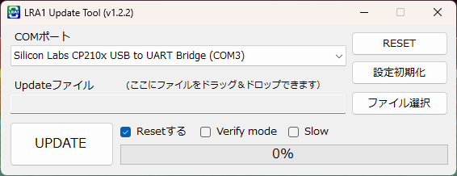
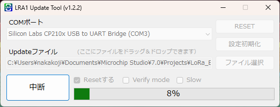
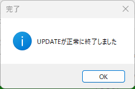

# LRA1 Tool for Windows（GUIアップデートツール）

このツールは、LoRa通信モジュール「LRA1」向けの  
公式ファームウェア（.bin）を書き込むための **Windows専用GUIアプリケーション** です。

Shachi-labにより開発・保守されており、i2-electronicsでも提供されています。

---

## ✅ 主な機能

- `.bin` ファイルの選択と書き込み操作が可能
- USBドングルまたはFTDIアダプタ経由の接続に対応
- 書き込み中の進捗表示、成功・失敗判定付き

---

## 🖥️ 対応環境

- Windows 10 / 11（64bit）
- USBシリアル変換IC（FT232RL / CH340 など）に対応  

---

## 📦 ダウンロード

最新版のインストーラーおよびポータブル版は、以下のリリースページから取得できます：

🔗 [最新リリースページ](https://github.com/shachi-lab/lra1_tool_win/releases/latest)

> ファイル名の例：  
> - `LRA1_Update_Tool_v1.2.2_Installer.msi`  
> - `LRA1_Update_Tool_v1.2.2_Portable.zip`

過去バージョンも含めた一覧はこちら：  
🔗 [すべてのリリース](https://github.com/shachi-lab/lra1_tool_win/releases)

---

## 🆕 最新バージョン: v1.2.2

- MSI形式インストーラー追加
- 書き込み後の完了メッセージを改善
- COMポート選択時の安定性を向上

---

## 📸 使用イメージ

起動画面
  

書き込み中
  

完了

---

## 🔧 使い方（基本手順）

1. `.bin` ファイルを選択
2. 接続されたLRA1のCOMポートを選択
3. 「UPDATE」ボタンを押すだけ！

> 書き込み後、成功メッセージが表示されれば完了です。

---

## 📜 ライセンスと注意事項

- 本ツールは **LRA1専用** です。他のデバイスには使用しないでください。
- バイナリ形式でのみ提供され、ソースコードは公開していません。
- 無断での再配布は禁止されています。
- 商用利用・製品への組み込みを希望される場合はご相談ください。

---

© 2025 Shachi-lab / i2-electronics
